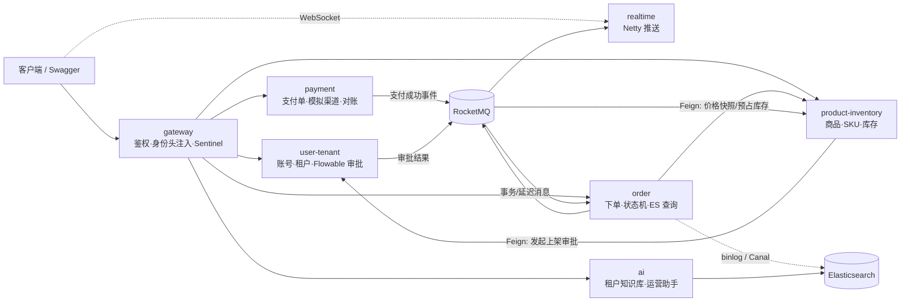
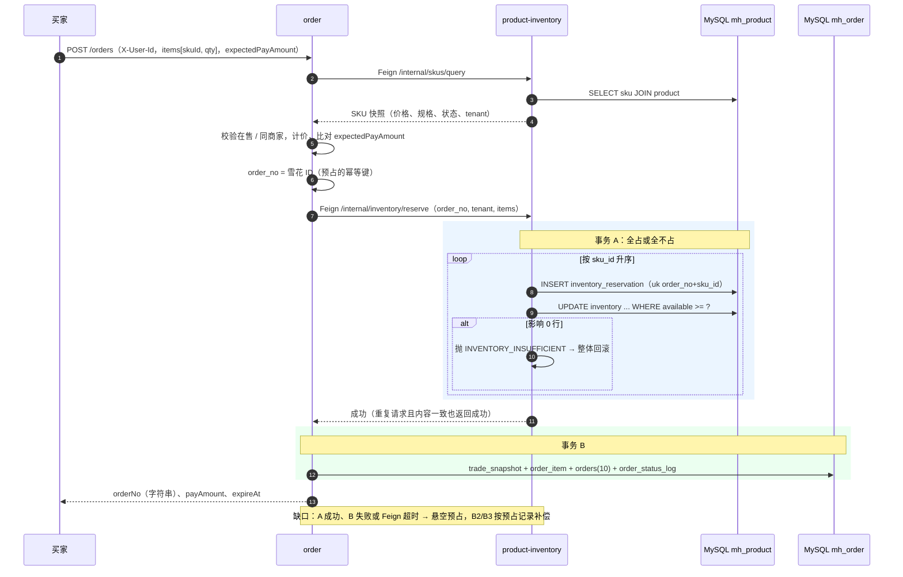
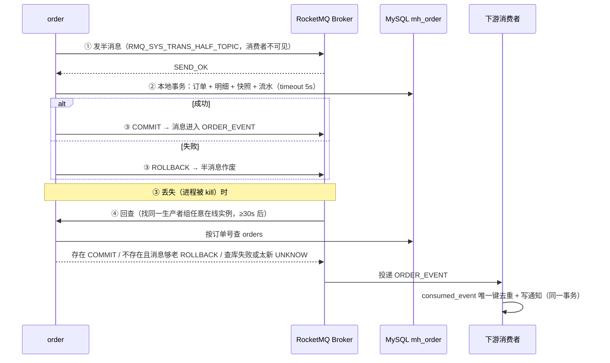
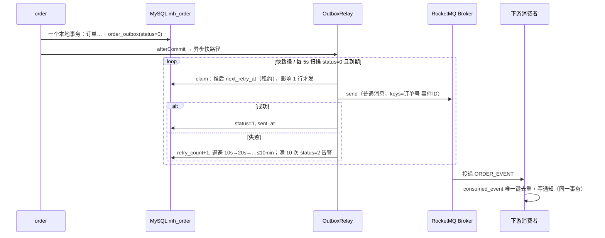
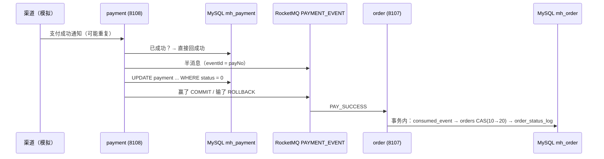

# 架构

## 服务划分（A1 定稿）

```mermaid
flowchart LR
    Client[客户端 / Swagger] --> GW[gateway<br/>鉴权·身份头注入·Sentinel]
    Client -. WebSocket .-> RT[realtime<br/>Netty 推送]

    GW --> UT[user-tenant<br/>账号·租户·Flowable 审批]
    GW --> PI[product-inventory<br/>商品·SKU·库存]
    GW --> OD[order<br/>下单·状态机·ES 查询]
    GW --> PAY[payment<br/>支付单·模拟渠道·对账]
    GW --> AI[ai<br/>租户知识库·运营助手]

    OD -- Feign: 价格快照/预占库存 --> PI
    PI -- Feign: 发起上架审批 --> UT

    MQ[(RocketMQ)]
    OD -- 事务/延迟消息 --> MQ
    PAY -- 支付成功事件 --> MQ
    UT -- 审批结果 --> MQ
    MQ --> OD
    MQ --> PI
    MQ --> RT

    OD -. binlog / Canal .-> ES[(Elasticsearch)]
    AI --> ES
```

## 下单 + 库存预占（B1）

```mermaid
sequenceDiagram
    autonumber
    participant B as 买家
    participant O as order
    participant PI as product-inventory
    participant DBP as MySQL mh_product
    participant DBO as MySQL mh_order

    B->>O: POST /orders（X-User-Id，items[skuId, qty]，expectedPayAmount）
    O->>PI: Feign /internal/skus/query
    PI->>DBP: SELECT sku JOIN product
    PI-->>O: SKU 快照（价格、规格、状态、tenant）
    O->>O: 校验在售 / 同商家，计价，比对 expectedPayAmount
    O->>O: order_no = 雪花 ID（预占的幂等键）
    O->>PI: Feign /internal/inventory/reserve（order_no, tenant, items）
    rect rgb(235, 245, 255)
    Note over PI,DBP: 事务 A：全占或全不占
    loop 按 sku_id 升序
        PI->>DBP: INSERT inventory_reservation（uk order_no+sku_id）
        PI->>DBP: UPDATE inventory ... WHERE available >= ?
        alt 影响 0 行
            PI->>PI: 抛 INVENTORY_INSUFFICIENT → 整体回滚
        end
    end
    end
    PI-->>O: 成功（重复请求且内容一致也返回成功）
    rect rgb(235, 255, 240)
    Note over O,DBO: 事务 B
    O->>DBO: trade_snapshot + order_item + orders(10) + order_status_log
    end
    O-->>B: orderNo（字符串）、payAmount、expireAt
    Note over O,PI: 缺口：A 成功、B 失败或 Feign 超时 → 悬空预占，B2/B3 按预占记录补偿
```

## 订单已创建事件：两种可靠发送方案（B2）

### 方案一：RocketMQ 事务消息（`event-mode=TX_MESSAGE`）

```mermaid
sequenceDiagram
    participant O as order
    participant B as RocketMQ Broker
    participant DB as MySQL mh_order
    participant C as 下游消费者
    O->>B: ① 发半消息（RMQ_SYS_TRANS_HALF_TOPIC，消费者不可见）
    B-->>O: SEND_OK
    O->>DB: ② 本地事务：订单 + 明细 + 快照 + 流水（timeout 5s）
    alt 成功
        O->>B: ③ COMMIT → 消息进入 ORDER_EVENT
    else 失败
        O->>B: ③ ROLLBACK → 半消息作废
    end
    Note over O,B: ③ 丢失（进程被 kill）时
    B->>O: ④ 回查（找同一生产者组任意在线实例，≥30s 后）
    O->>DB: 按订单号查 orders
    O-->>B: 存在 COMMIT / 不存在且消息够老 ROLLBACK / 查库失败或太新 UNKNOW
    B->>C: 投递 ORDER_EVENT
    C->>C: consumed_event 唯一键去重 + 写通知（同一事务）
```

### 方案二：本地消息表（`event-mode=OUTBOX`，默认）

```mermaid
sequenceDiagram
    participant O as order
    participant DB as MySQL mh_order
    participant R as OutboxRelay
    participant B as RocketMQ Broker
    participant C as 下游消费者
    O->>DB: 一个本地事务：订单… + order_outbox(status=0)
    O->>R: afterCommit → 异步快路径
    loop 快路径 / 每 5s 扫描 status=0 且到期
        R->>DB: claim：推后 next_retry_at（租约），影响 1 行才发
        R->>B: send（普通消息，keys=订单号 事件ID）
        alt 成功
            R->>DB: status=1, sent_at
        else 失败
            R->>DB: retry_count+1, 退避 10s→20s→…≤10min；满 10 次 status=2 告警
        end
    end
    B->>C: 投递 ORDER_EVENT
    C->>C: consumed_event 唯一键去重 + 写通知（同一事务）
```

## 支付回调 → 订单已支付（B3-上）

```mermaid
sequenceDiagram
    participant CH as 渠道（模拟）
    participant P as payment (8108)
    participant DBP as MySQL mh_payment
    participant MQ as RocketMQ PAYMENT_EVENT
    participant O as order (8107)
    participant DBO as MySQL mh_order
    CH->>P: 支付成功通知（可能重复）
    P->>DBP: 已成功？→ 直接回成功
    P->>MQ: 半消息（eventId = payNo）
    P->>DBP: UPDATE payment ... WHERE status = 0
    P->>MQ: 赢了 COMMIT / 输了 ROLLBACK
    MQ->>O: PAY_SUCCESS
    O->>DBO: 事务内：consumed_event → orders CAS(10→20) → order_status_log
```
