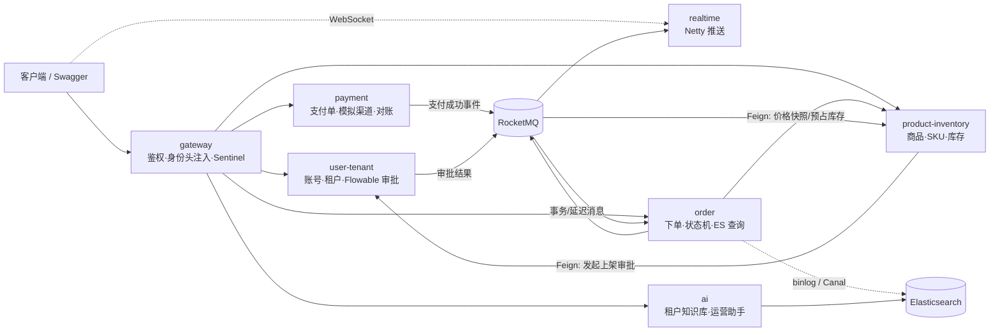

# 架构

## 服务划分（A1 定稿）

```mermaid
flowchart LR
    Client[客户端 / Swagger] --> GW[gateway<br/>鉴权·身份头注入·Sentinel]
    Client -. WebSocket .-> RT[realtime<br/>Netty 推送]

    GW --> UT[user-tenant<br/>账号·租户·Flowable 审批]
    GW --> PI[product-inventory<br/>商品·SKU·库存]
    GW --> OD[order<br/>下单·状态机·ES 查询]
    GW --> PAY[payment<br/>支付单·模拟渠道·对账]
    GW --> AI[ai<br/>租户知识库·运营助手]

    OD -- Feign: 价格快照/预占库存 --> PI
    PI -- Feign: 发起上架审批 --> UT

    MQ[(RocketMQ)]
    OD -- 事务/延迟消息 --> MQ
    PAY -- 支付成功事件 --> MQ
    UT -- 审批结果 --> MQ
    MQ --> OD
    MQ --> PI
    MQ --> RT

    OD -. binlog / Canal .-> ES[(Elasticsearch)]
    AI --> ES
```

核心链路时序图在 A3 及 B 组任务中补充。
