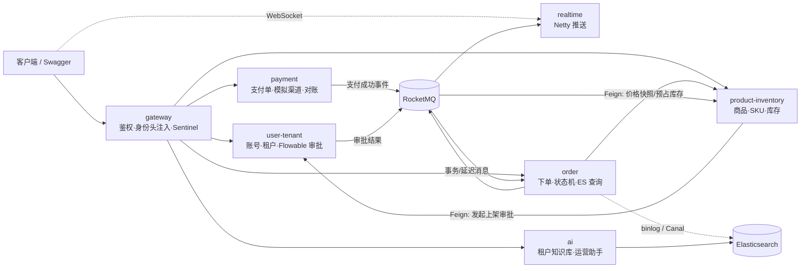
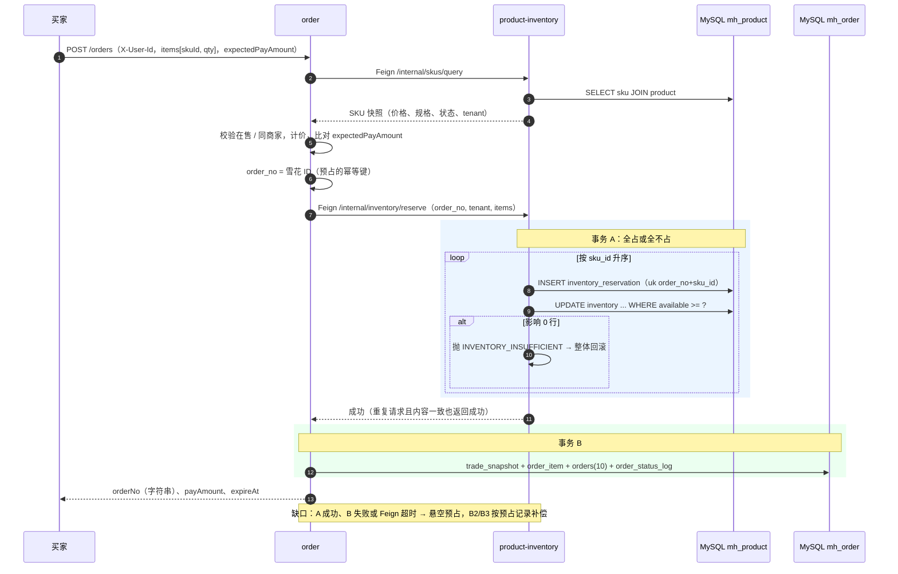

# 架构

## 服务划分（A1 定稿）

```mermaid
flowchart LR
    Client[客户端 / Swagger] --> GW[gateway<br/>鉴权·身份头注入·Sentinel]
    Client -. WebSocket .-> RT[realtime<br/>Netty 推送]

    GW --> UT[user-tenant<br/>账号·租户·Flowable 审批]
    GW --> PI[product-inventory<br/>商品·SKU·库存]
    GW --> OD[order<br/>下单·状态机·ES 查询]
    GW --> PAY[payment<br/>支付单·模拟渠道·对账]
    GW --> AI[ai<br/>租户知识库·运营助手]

    OD -- Feign: 价格快照/预占库存 --> PI
    PI -- Feign: 发起上架审批 --> UT

    MQ[(RocketMQ)]
    OD -- 事务/延迟消息 --> MQ
    PAY -- 支付成功事件 --> MQ
    UT -- 审批结果 --> MQ
    MQ --> OD
    MQ --> PI
    MQ --> RT

    OD -. binlog / Canal .-> ES[(Elasticsearch)]
    AI --> ES
```

## 下单 + 库存预占（B1）

```mermaid
sequenceDiagram
    autonumber
    participant B as 买家
    participant O as order
    participant PI as product-inventory
    participant DBP as MySQL mh_product
    participant DBO as MySQL mh_order

    B->>O: POST /orders（X-User-Id，items[skuId, qty]，expectedPayAmount）
    O->>PI: Feign /internal/skus/query
    PI->>DBP: SELECT sku JOIN product
    PI-->>O: SKU 快照（价格、规格、状态、tenant）
    O->>O: 校验在售 / 同商家，计价，比对 expectedPayAmount
    O->>O: order_no = 雪花 ID（预占的幂等键）
    O->>PI: Feign /internal/inventory/reserve（order_no, tenant, items）
    rect rgb(235, 245, 255)
    Note over PI,DBP: 事务 A：全占或全不占
    loop 按 sku_id 升序
        PI->>DBP: INSERT inventory_reservation（uk order_no+sku_id）
        PI->>DBP: UPDATE inventory ... WHERE available >= ?
        alt 影响 0 行
            PI->>PI: 抛 INVENTORY_INSUFFICIENT → 整体回滚
        end
    end
    end
    PI-->>O: 成功（重复请求且内容一致也返回成功）
    rect rgb(235, 255, 240)
    Note over O,DBO: 事务 B
    O->>DBO: trade_snapshot + order_item + orders(10) + order_status_log
    end
    O-->>B: orderNo（字符串）、payAmount、expireAt
    Note over O,PI: 缺口：A 成功、B 失败或 Feign 超时 → 悬空预占，B2/B3 按预占记录补偿
```

